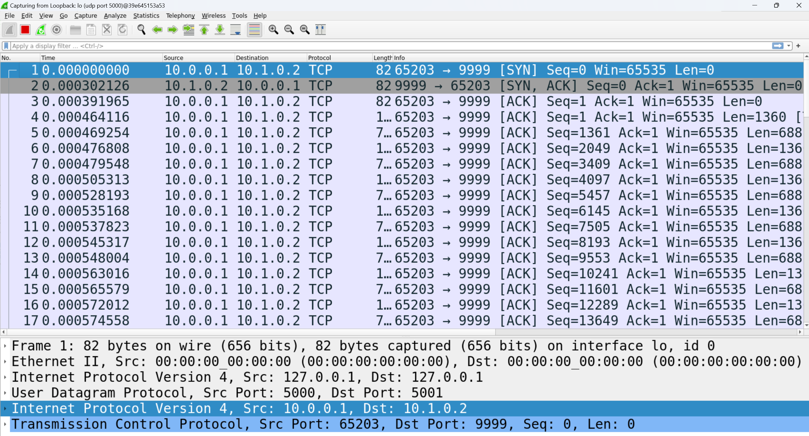
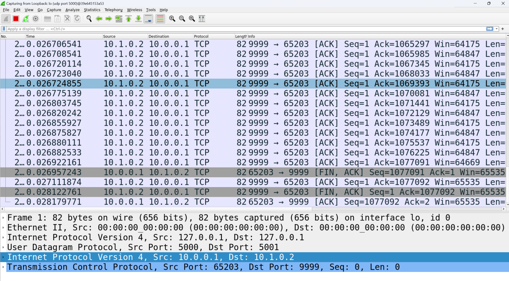
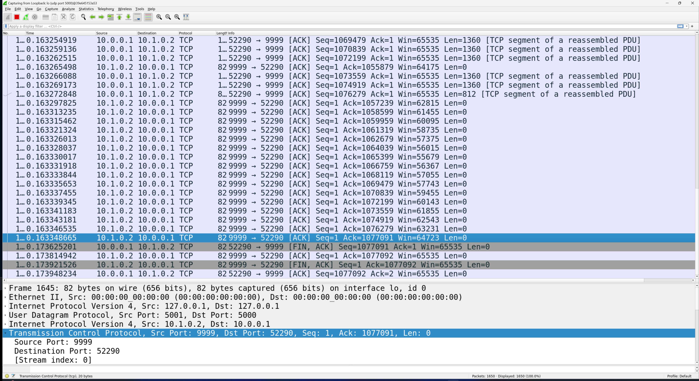

# vhost and vrouter Implementation

This project implements a virtual host (vhost) and a virtual router (vrouter) as part of a network simulation environment. Both programs use a shared network stack implementation to handle IP packet routing and forwarding.

## Components

1. **vhost**: A virtual host implementation that can send and receive packets.
2. **vrouter**: A virtual router implementation that can route packets and implements the RIP (Routing Information Protocol) for dynamic routing.

## Features

Both vhost and vrouter support the following features:

- Sending test packets
- Listing interfaces
- Listing neighbors
- Listing routes
- Enabling/disabling interfaces

Additionally, vrouter implements:

- RIP protocol for dynamic routing
- Periodic RIP updates

## Usage

### Compilation

To compile the programs, use the following commands:

```
go build -o vhost cmd/vhost/vhost.go
go build -o vrouter cmd/vrouter/vrouter.go
```
or simply `make`


### Running

Both programs require a configuration file to be specified:

```
./vhost --config path/to/host_config.lnx
./vrouter --config path/to/router_config.lnx
```

Specify specific topology by running:
```
util/vnet_run [--bin-dir BIN_DIR] lnx_dir
```

### Command-Line Interface

Once running, both vhost and vrouter provide a command-line interface with the following commands:

- `send <destination_ip> <message>`: Send a test packet
- `li`: List interfaces
- `ln`: List neighbors
- `lr`: List routes
- `up <ifname>`: Enable an interface
- `down <ifname>`: Disable an interface
- `exit` or `q`: Exit the program

## Differences between vhost and vrouter

1. **RIP Implementation**: vrouter implements the RIP protocol, while vhost does not.
2. **Periodic Updates**: vrouter sends periodic RIP updates every 5 seconds.
3. **Initialization**: vrouter is initialized with `isRouter` set to true, while vhost sets it to false.

## Implementation Details

- Both programs use a shared network stack implemented in the `network_layer` and `link_layer` packages.
- The network layer handles IP packet routing and forwarding.
- The link layer simulates network interfaces using UDP sockets.
- RIP messages are sent using IP protocol 200.
- The forwarding table is dynamically updated based on received RIP messages in vrouter.


# IP Stack APIs Implementation

## Answers to Key Questions

### 1. How did you build the abstractions for the IP layer and interfaces?

There are two main classes, `NetworkLayer` and `LinkLayer`, defined in their respective packages under the `pkg` directory. These classes provide the API methods to interact with upper or lower layers, along with several helper functions. They also contain fields that store variables required globally during execution. For example, `NetworkLayer` contains the forwarding table, while `LinkLayer` holds interface-related information. These fields are initialized within the respective class' `initialize` method.

The `vhost` and `vrouter` programs directly create instances of these classes, which allow them to call the provided API methods.

### 2. How do you use threads/goroutines?

There are several key areas where goroutines are employed:

1. In the `vrouter` program, a goroutine periodically invokes the `AdvertiseNeighbors` method to send RIP responses to all neighbors.
   
2. During the `NetworkLayer` initialization, a goroutine is started to decrement the lifetime of each forwarding table entry every second.
   
3. In `LinkLayer`, each interface has its own corresponding goroutine.

### 3. What are the steps involved in processing IP packets?

1. The goroutine corresponding to the `LinkLayer` interface receives a UDP packet, extracts the IP packet contained within, and associates the MAC (port) address with the IP address. It then calls the `ReceiveIpPacket(packet *IpPacket, thisHopIp netip.Addr)` API provided by the `NetworkLayer`.
   
2. Once the packet reaches the `NetworkLayer`, the following steps are taken:

   1. TTL is checked.
   2. The checksum is validated.
   3. If the current hop IP matches the destination IP in the packet, the handler function corresponding to the protocol number is called (this function is registered by the user program). If the IP does not match, the packet is forwarded.

## Notable Design Choices

### 1. Dependency Injection

Since the `NetworkLayer` and `LinkLayer` need to call each other’s API functions but cannot have mutual dependencies, I implemented a dependency injection pattern. Each class has an `xxxAPI` field that is an interface defined in the `common` package. For example During the initialization of the `NetworkLayer` class, instances are injected via methods like `SetLinkLayerApi`, where the `LinkLayer` instance is passed into `NetworkLayer`. This design achieves decoupling, making it easier to swap out the implementation of `LinkLayer` in the future by simply passing in a new instance that implements the necessary interface.

### 2. Atomic Integer Usage

After careful consideration, I decided to use atomic integers for the `lifetime` field in the forwarding table entries. By doing this, there's no need to lock the forwarding table. While multiple interfaces may modify the forwarding table concurrently, they will never modify the same entry simultaneously. This is because each prefix has only one exit interface, preventing race conditions.

# TCP Stack

## 1. Top-Level Connection Management:
Tcp struct acts as the connection manager, maintaining:

- `listenSockets`: Map of ports to listening sockets
- `activeSockets`: Map of ConnectionIDs to established connections
- Each connection is uniquely identified by a ConnectionID containing both endpoints (local/remote IP:port pairs)

## 2. Individual Connection State (Socket struct):

- Core connection identifiers (IPs and ports)
- State machine management (LISTEN, ESTABLISHED, etc.) with mutex protection
- Contains the key buffers that handle data flow

## 3. Data Flow Management:

- SendBuffer: Handles outbound data with:
   - Circular buffer for data storage
   - Sequence number tracking (sndUna, sndNxt, sndWnd)
   - unackedSegments: Queue of unacknowledged segments for retransmission
   - Window size management for flow control
   - RTT statistics for timeout calculations

- ReceiveBuffer: Handles inbound data with:
   - Buffer for ordered data delivery
   - Next expected sequence number (rcvNxt)
   - Window size management
   - oooSegments: Queue for out-of-order segments


## 4. Reliability Features:

- RTTStats: Manages RTT estimation and RTO calculation with:
   - Smoothed RTT
   - RTT variation
   - Current RTO value
- Segment: Represents a TCP segment with:
   - Sequence number
   - Retransmission count
   - Last transmission timestamp
   - Acknowledgment status

## 5. Key Data Structures for Retransmission:

### 5.1 Segment Tracking
```
type Segment struct {
    Data      []byte
    SeqNum    uint32
    RetxCount int       // Number of retransmissions tried
    LastSent  time.Time // Last transmission timestamp
    Acked     bool
}
```

### 5.2 In SendBuffer
```
type SendBuffer struct {
    unackedSegments []*Segment  // Queue of segments waiting for ACK
    rttStats        RTTStats    // For RTO calculation
}
```

### 5.3 RTT Management
```
type RTTStats struct {
    srtt   time.Duration // Smoothed round-trip time
    rttvar time.Duration // RTT variation
    rto    time.Duration // Current retransmission timeout
}
```
The retransmission logic:
- `unackedSegments` queue tracks segments that haven't been acknowledged yet
- Each segment tracks its retransmission count (up to MaxTryTime = 10)
- The RTT stats determine how long to wait before retransmitting (RTO)
- The system uses Karn's algorithm (only updating RTT for segments that weren't retransmitted)

When retransmission is needed:

1. Takes the oldest unacked segment from the queue
2. Checks if RTO has elapsed since LastSent
3. If yes, retransmits and increments RetxCount
4. If RetxCount exceeds MaxTryTime, terminates the connection

## 6. TCP Socket Threading Implementation

This part describes the threading model for handling `send` and `receive` commands. The threading model ensures efficient data transmission by dedicating specific threads to distinct tasks, allowing asynchronous processing and minimal contention.

### Send Operation

#### Main Thread
When the vhost receives a `s <socketID> <content>` command, the following sequence occurs:

1. The vhost's main thread calls the `VWrite` function on the corresponding socket.
2. `VWrite` writes the content into the `sendbuffer`, updates the `sndLbw` pointer, and signals the `condEmpty` condition variable to notify the send thread that new data is available for transmission.

#### Send Thread

- **Creation**: this dedicated thread for sending data is created when the socket is established.
- **Functionality**:
  - Continuously sends data from the `sendbuffer` in a `while` loop.
  - Waits on two condition variables, `condEmpty` and `condSndWnd`. The thread blocks when the `sendbuffer` is empty or the send window is zero and wakes up when signaled.
  - Removes and sends data from the ring buffer, updates the `sndNxt` pointer, and adds sent segments to the `unackedSegments` list.

#### Supporting Threads

- **Zero Window Probing Thread**:
  - Handles zero window probing in a `while` loop.
  - Controlled by the `condSndWnd` condition variable. The thread blocks when the send window is non-zero.
  
- **Retransmission Thread**:
  - Handles retransmissions independently without any condition variable control.
  - Apart from acquiring and releasing locks for shared variables, this thread operates in isolation.

```go
func (t *Tcp) StartSocketSending(s *Socket) {
    go t.handleSending(s)        // Handle normal sending
    go t.handleZeroWndProbing(s) // Handle zero window probing
    go t.handleRetransmission(s) // Handle retransmission
}
```

### Receive Operation
#### Main Thread
When the vhost receives an `r <socketID> <length>` command, the following sequence occurs:

1. The vhost's main thread calls the `VRead` function on the corresponding socket.
2. If the `receivebuffer` is empty, the thread blocks on the `condEmpty` condition variable until data becomes available.

#### Packet Processing Thread

 this thread for processing packets is created during the initialization of the link layer.
  
```go
for _, conn := range l.connMap {
    go func() {
        for {
            buffer := make([]byte, common.MTU)
            bytesRead, _, err := conn.ReadFromUDP(buffer)
            if err != nil {
                log.Println(err)
            }

            err = l.handleUdpPacket(buffer[:bytesRead], conn)
            if err != nil {
                log.Println(err)
            }
        }
    }()
}
```
This thread calls `func handleUdpPacket` to process packets through the API stack, layer by layer. Eventually, in `HandleTCPPacket`, it processes TCP packets by performing the following steps:
1. **UpdateWindowSize**: Updates the window size and signals the `condSndWnd` condition variable.
2. **ProcessAck**: Updates `UnackedSegments`, RTT, and moves `sndUna`.
3. If the packet contains a payload, it processes the packet, writes data into the `receivebuffer`, increments `rcvNxt`, and decreases `rcvWnd`.
#### Thread Communication

Each thread operates independently, focusing on its specific task. Threads communicate only through three condition variables (`condEmpty`, `condSndWnd`, and `condRetransmit`) and by acquiring locks to access shared variables.

---

### Key Features

- **Asynchronous Processing**: Each thread is dedicated to a single responsibility, ensuring efficient task management.
- **Condition Variables**: Threads are synchronized using three condition variables, minimizing contention.
- **Scalability**: The isolated threading model allows for scalable and robust socket handling.


## Performance Comparison

The following images show the start and end times for sending a file in the reference version and our version:

### Reference Version
- **Start Time**:

- **End Time**:


### Our Version
- **Start Time**:

- **End Time**:


From these results, the reference version took **0.027s**, while our version took **0.062s**. Both are in the same magnitude of time.

## Packet capture
- The 3-way handshake: pkt1, 4, 5
  
- One segment sent and acknowledged: pkt 15 & 18
  
- One segment that is retransmitted: pkt 649
  
- Connection teardown: pkt 3081, 3084, 3086, 3087
   


  
